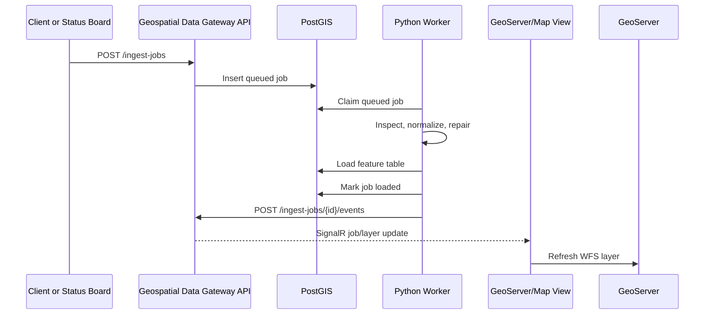

# Architecture

Geospatial Data Gateway owns data intake, normalization, and layer lifecycle metadata.
It does not replace the companion projects. It gives them a shared operational
contract.

## Responsibilities

| Component | Responsibility |
| --- | --- |
| ASP.NET Core API | Dataset catalog, ingest job creation, status updates, and live event fan-out. |
| Python worker | File/feed inspection, CRS normalization, geometry repair, and PostGIS loading. |
| PostGIS | Metadata tables plus loaded feature tables that GeoServer can publish. |
| GeoServer | OGC/WFS publication of loaded feature tables. |
| Status board | User-facing map, layer controls, and eventual live refresh subscription. |
| GeoAI platform | Imagery/model workflows that can submit detection outputs or source footprints. |

## Flow

## Schema Strategy

Gateway metadata defaults to the `geomain` schema:

- `geomain.datasets`
- `geomain.ingest_jobs`
- `geomain.ingest_events`
- `geomain.layer_loads`

Feature tables default to `public` because the existing status-board GeoServer setup
already publishes from that schema. Production deployments can point feature loads at
a dedicated schema such as `gateway_layers`.

Every loaded feature table should include:

- `dataset_id`
- `job_id`
- `source_name`
- `loaded_at`
- `geom`

## First Integration Target

The first useful integration is simple:

1. Load `examples/sample-sites.geojson` into the same PostGIS database used by the
   status board.
2. Publish the loaded table as a GeoServer layer.
3. Add the layer to the status board's `geo.layers` config.
4. Use the gateway job status to decide when the map should refresh.
